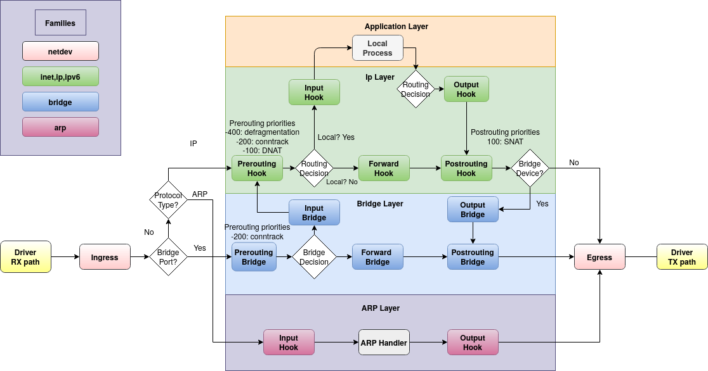

# nftables的钩子处理如下



关于什么是nftables钩子以及nftables钩子的处理过程

`nftables` 是 Linux 内核中用于包过滤、网络地址转换(NAT)和数据包分类等功能的框架，它是 `iptables` 的继承者。在 `nftables` 中，流量处理是通过一系列的规则和链(chain)来实现的，而钩子(hooks)是这一流程中的关键概念。

### 钩子（Hooks）

钩子是 `nftables` 中一种特定的点，它允许 `nftables` 规则在网络栈的特定阶段被触发。每个钩子对应于网络栈处理数据包的不同阶段，例如，当数据包进入网络接口时、在进行路由决策之前、在数据包离开网络接口之前等。

### 如何处理流量

1. **数据包进入**
   - 当数据包到达网络设备时，它首先会被 `prerouting` 钩子捕获，这个阶段主要用于地址转换（如NAT）之前的决策。

2. **路由决策**
   - 经过 `prerouting` 钩子处理后，下一步是路由决策，系统根据路由表决定数据包是应该被本机处理（本地交付）还是应该被转发。

3. **本地交付**
   - 如果数据包是发往本机的，它将进入 `input` 钩子，这里可以应用一系列规则来决定是否接受这些数据包。

4. **数据包生成**
   - 本地应用程序生成的出站数据包会被 `output` 钩子捕获，这个阶段允许对出站数据包应用过滤或修改规则。

5. **数据包发送**
   - 在数据包最终离开网络设备之前，`postrouting` 钩子会被触发，这通常用于出站地址转换或其他需要在数据包发送之前进行的最终修改。

6. **转发**
   - 对于需要被转发的数据包，在路由决策之后和实际转发之前，`forward` 钩子会被触发，允许在转发数据包前应用一系列的过滤规则。

通过这些钩子，`nftables` 可以在网络栈的不同阶段灵活地应用规则集，实现对进入、出站和转发数据包的精细控制。这种机制提供了极大的灵活性和强大的功能，使得 `nftables` 成为现代Linux系统中网络包过滤和流量管理的核心工具。

# 流量处理流程

## 1. 进入本地的流量处理

### **1. 入站流量处理**

- **进入设备**：数据包到达网络设备的某个接口。
- **nftables `prerouting` 链**：
  - 数据包首先进入 nftables 的 **`prerouting`** 链，应用 **`route`** 链的规则（如 **`type route hook prerouting`**）。
  - 在 **`prerouting`** 链中，数据包可以被标记、修改或重定向。
- **路由决策**：
  - 在经过 **`prerouting`** 链后，系统会查阅路由表，决定数据包的最终目的地（本地交付或转发到另一个接口）。
- **nftables `input` 链**：
  - 如果数据包的最终目的地是本地主机，它会进入 **`input`** 链，在这里应用更多的过滤规则。
- **应用层处理**：
  - 数据包最终到达目标应用程序或服务。

### **2. 出站流量处理**

- **生成数据包**：本地主机上的应用程序生成数据包。
- **路由决策**：
  - 系统会查阅路由表，决定数据包的下一跳（通过哪个接口发送到外部网络）。
- **nftables `output` 链**：
  - 数据包首先进入 nftables 的 **`output`** 链，应用相关的过滤和 NAT 规则。
- **nftables `postrouting` 链**：
  - 数据包在最终发送前进入 **`postrouting`** 链，这里可以再次应用 NAT 等规则。
- **发送数据包**：数据包通过路由表决定的接口发送到外部网络。

## **2. 转发流量处理**

- **进入设备**：数据包到达网络设备的某个接口。
- **nftables `prerouting` 链**：
  - 数据包首先进入 **`prerouting`** 链，应用 **`route`** 链的规则。
- **路由决策**：
  - 系统查阅路由表，决定数据包的下一跳（通过哪个接口转发）。
- **nftables `forward` 链**：
  - 如果数据包需要转发到其他网络，它会进入 **`forward`** 链，应用相关的过滤规则。
- **nftables `postrouting` 链**：
  - 在转发之前，数据包进入 **`postrouting`** 链，应用 NAT 等规则。
- **转发数据包**：数据包通过路由表决定的接口发送到下一个目的地。

## 3.优质示例

有段处理docker流量的nftables配置如下：

```bash
table inet filter {
  chain input {
    type filter hook input priority filter; policy accept;
    iifname "lo" accept
    ct state established,related accept
    ip protocol icmp accept
    ip6 nexthdr ipv6-icmp accept
    tcp dport 50023 drop
    tcp dport { 443, 5555 } accept
    tcp dport 50000-50100 accept
    udp dport 50000-50100 accept
    reject
  }

  chain forward {
    type filter hook forward priority filter; policy accept;
  }

  chain output {
    type filter hook output priority filter; policy accept;
  }
}
table ip nat {
  chain DOCKER {
    iifname "docker0" counter packets 0 bytes 0 return
    iifname != "docker0" meta l4proto tcp tcp dport 8080 counter packets 2 bytes 104 dnat to 172.17.0.2:80
  }

  chain POSTROUTING {
    type nat hook postrouting priority srcnat; policy accept;
    oifname != "docker0" ip saddr 172.17.0.0/16 counter packets 0 bytes 0 masquerade 
    meta l4proto tcp ip saddr 172.17.0.2 ip daddr 172.17.0.2 tcp dport 80 counter packets 0 bytes 0 masquerade 
  }

  chain PREROUTING {
    type nat hook prerouting priority dstnat; policy accept;
    fib daddr type local counter packets 74 bytes 3969 jump DOCKER
  }

  chain OUTPUT {
    type nat hook output priority -100; policy accept;
    ip daddr != 127.0.0.0/8 fib daddr type local counter packets 0 bytes 0 jump DOCKER
  }
}
table ip filter {
  chain DOCKER {
    iifname != "docker0" oifname "docker0" meta l4proto tcp ip daddr 172.17.0.2 tcp dport 80 counter packets 2 bytes 104 accept
  }

  chain DOCKER-ISOLATION-STAGE-1 {
    iifname "docker0" oifname != "docker0" counter packets 12 bytes 2091 jump DOCKER-ISOLATION-STAGE-2
    counter packets 26 bytes 4303 return
  }

  chain DOCKER-ISOLATION-STAGE-2 {
    oifname "docker0" counter packets 0 bytes 0 drop
    counter packets 12 bytes 2091 return
  }

  chain FORWARD {
    type filter hook forward priority filter; policy drop;
    counter packets 26 bytes 4303 jump DOCKER-USER
    counter packets 26 bytes 4303 jump DOCKER-ISOLATION-STAGE-1
    oifname "docker0"  ip saddr  
    oifname "docker0" ct state related,established counter packets 12 bytes 2108 accept
    oifname "docker0" counter packets 2 bytes 104 jump DOCKER
    iifname "docker0" oifname != "docker0" counter packets 12 bytes 2091 accept
    iifname "docker0" oifname "docker0" counter packets 0 bytes 0 accept
  }

  chain DOCKER-USER {
    counter packets 26 bytes 4303 return
  }
}

```

解释如下：

### 表 `inet filter` 的作用：

- **链 `input`**：处理进入本机的数据包。  
  - 默认策略是接受所有数据包。  
  - 允许来自本地接口(`lo`)的数据包。  
  - 允许已建立或相关连接的数据包（基于连接追踪）。  
  - 允许ICMP（用于ping等）和IPv6-ICMP数据包。  
  - 拒绝目的端口为50023的TCP数据包。  
  - 允许目的端口为443或5555的TCP数据包。  
  - 允许目的端口在50000到50100之间的TCP和UDP数据包。  
  - 其他所有未匹配规则的数据包被拒绝。

- **链 `forward`** 和 **`output`**：分别处理转发的数据包和发出的数据包。默认策略是接受所有数据包，但没有定义特定的过滤规则。

### 表 `ip nat` 的作用：

处理地址转换，主要用于Docker容器。

- **链 `DOCKER`**：针对Docker容器的流量做特殊处理。  
  - 来自`docker0`接口的数据包直接返回，不做处理。  
  - 非`docker0`接口的、目的端口为8080的TCP数据包进行目的地址转换到172.17.0.2:80。

- **链 `POSTROUTING`** 和 **`PREROUTING`**：分别处理出站后和入站前的数据包。  
  - 对于源自172.17.0.0/16的出站数据包，使用伪装（masquerade）进行源地址转换。  
  - 对于指定的入站数据包，跳转到`DOCKER`链进行处理。

- **链 `OUTPUT`**：处理本机产生的出站数据包。  
  - 对于目的地址不是127.0.0.1的本地数据包，跳转到`DOCKER`链进行处理。

### 表 `ip filter` 的作用：

处理针对Docker容器的过滤规则。

- **链 `DOCKER`** 和 **`DOCKER-ISOLATION-STAGE-1/2`**：定义了Docker容器间通信的隔离和策略规则。  
  - 处理Docker容器间的网络隔离，允许或拒绝特定的流量。

- **链 `FORWARD`**：处理转发的数据包。  
  - 默认策略是拒绝所有转发的数据包。  
  - 定义了一系列规则，允许或跳转到其他链（如`DOCKER`, `DOCKER-ISOLATION-STAGE-1`）对数据包进行进一步处理。

- **链 `DOCKER-USER`**：允许用户定义额外的过滤规则。

简要解释如下：
>这些规则主要用于控制和管理网络流量，包括接受或拒绝特定的流量，进行网络地址转换，以及隔离Docker容器的网络流量。